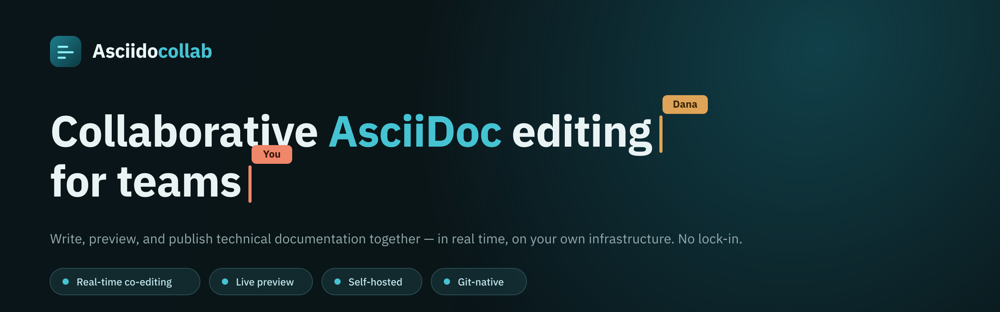

<p align="center"></p>

<p align="center">
  <a href="https://github.com/joaoleal/asciidocollab/actions/workflows/ci.yml"></a>
  <a href="LICENSE"></a>
  = 24">
  = 11">
  
</p>

> **⚠ Pre-MVP — not ready for production use.**
> The editor, file management, and real-time co-editing are built and working — co-editing is under active
> hardening. Git integration and PDF export are not yet built. See [Project status](#project-status) for the
> honest picture.

**Collaborative AsciiDoc editing for teams — self-hosted, secure, and built for real work.**

Write technical documentation, books, and structured content in AsciiDoc format — together, in real time, in your
browser. No lock-in, no vendor dependency: deploy it on your own infrastructure and keep full control of your documents.

---

## What it does

AsciiDoCollab gives your team a shared space to write and manage AsciiDoc documents. Multiple people can edit the same
document simultaneously, preview rendered output live, export to PDF, and integrate with Git — all from a single,
self-hosted web application.

## Features

**Foundation (built, under active hardening)**

- Real-time co-editing — edit the same document together and see collaborators' cursors, selections, and changes
  as they happen; conflict-free by construction (Yjs CRDT over WebSocket) with shared undo/redo
- User accounts — self-registration with email verification, admin invitation flow
- Secure login with session management (Argon2id, encrypted sessions, rate limiting, breach detection
  via [Have I Been Pwned](https://haveibeenpwned.com))
- Create and manage projects to organise your work
- File and folder management — create, rename, move, delete files and folders; real-time tree sync via SSE
- Invite team members and assign roles — Viewer, Editor, or Owner
- Admin panel — manage users, toggle open registration, audit log
- Configurable email delivery (SMTP, SendGrid, or AWS SES)
- AsciiDoc code editor — CodeMirror 6 with AsciiDoc syntax highlighting, auto-save, table editing, autocomplete
  for images and includes, block title captions, and multiple editor themes
- Live HTML preview — Asciidoctor.js renders AsciiDoc to HTML in the browser

**Not yet built (MVP blockers)**

- Git integration — push, pull, branch, and create pull requests from the UI
- PDF export via Asciidoctor-PDF

**Planned after MVP**

- SSO / SAML 2.0 (Microsoft Entra ID and compatible providers)
- Multi-factor authentication and IP-based access controls

---

## Project status

**This project has not reached MVP.**

The authentication, file management, editor, and real-time collaboration layers are built and have been through
multiple rounds of code review and hardening. Git integration and PDF export — the remaining MVP features — are not
yet started.

| Layer                               | Status            |
|-------------------------------------|-------------------|
| Authentication & session management | ✅ Built, hardened |
| User registration & invitation flow | ✅ Built, hardened |
| Project & team management           | ✅ Built           |
| Admin panel & audit log             | ✅ Built           |
| File & folder management            | ✅ Built           |
| AsciiDoc editor                     | ✅ Built           |
| Live HTML preview                   | ✅ Built           |
| Real-time collaboration             | ✅ Built           |
| Git integration                     | ❌ Not started     |
| PDF export                          | ❌ Not started     |

Do not deploy this to production or rely on it for real work yet. The API and data model may change before MVP.

---

## Quickstart

The fastest way to get AsciiDoCollab running locally is with the included startup script. You need:

- [Docker](https://docs.docker.com/get-docker/) (for PostgreSQL and local email)
- [Node.js 24+](https://nodejs.org)
- [pnpm 11+](https://pnpm.io/installation)

```bash
git clone https://github.com/joaoleal/asciidocollab.git
cd asciidocollab
./scripts/dev.sh
```

The script will:

1. Start PostgreSQL and a local mail server via Docker
2. Create a `.env.local` from the provided template (auto-generating secrets)
3. Install all dependencies
4. Build the codebase and apply the database schema
5. Start the API server (`http://localhost:4000`), the collaboration WebSocket server
   (`ws://localhost:4002`), and the web app (`http://localhost:3000`)

**Local email preview** — all outbound emails (registration, password reset) are captured
by [Mailpit](https://mailpit.axllent.org) and visible at `http://localhost:8025`. Nothing is sent to real addresses.

---

## Configuration

Copy `.env.example` to `.env.local` and edit as needed. The only values you must change for a real deployment are:

| Variable                                    | Purpose                                                |
|---------------------------------------------|--------------------------------------------------------|
| `ASCIIDOCOLLAB_DATABASE_URL`                | PostgreSQL connection string                           |
| `ASCIIDOCOLLAB_AUTH_SESSION_SECRET`         | Cookie signing secret (run `openssl rand -base64 32`)  |
| `ASCIIDOCOLLAB_AUTH_SESSION_ENCRYPTION_KEY` | Session encryption key (run `openssl rand -base64 32`) |
| `ASCIIDOCOLLAB_API_FRONTEND_URL`            | Your public frontend URL                               |
| `ASCIIDOCOLLAB_AUTH_EMAIL_FROM`             | From address for outbound email                        |

For **real-time collaboration**, the web client connects to the collaboration WebSocket server:

| Variable                                                                                                                 | Purpose                                                                                                                |
|--------------------------------------------------------------------------------------------------------------------------|------------------------------------------------------------------------------------------------------------------------|
| `NEXT_PUBLIC_COLLAB_URL`                                                                                                 | WebSocket URL of the collab server (default `ws://localhost:4002`; use `wss://` in production)                         |
| `ASCIIDOCOLLAB_COLLAB_ALLOWED_ORIGINS`                                                                                   | Comma-separated allowlist of handshake Origins — **must** be set in production (CSWSH defence)                         |
| `ASCIIDOCOLLAB_COLLAB_MAX_PAYLOAD_BYTES` / `_MAX_CONNECTIONS_PER_USER` / `_MAX_ROOMS_PER_USER` / `_CONNECT_RATE_PER_MIN` | Per-user rate/size limits for the public WebSocket                                                                     |
| `ASCIIDOCOLLAB_COLLAB_EDIT_URL` / `ASCIIDOCOLLAB_COLLAB_INTERNAL_EDIT_PORT`                                              | API↔collab internal edit endpoint used to rewrite cross-file references in *live* documents (default loopback `:4003`) |
| `ASCIIDOCOLLAB_COLLAB_EDIT_SECRET` (= collab `_INTERNAL_EDIT_SECRET`) + the `_EDIT_TLS_*` / `_INTERNAL_EDIT_TLS_*` pairs | Secure the internal edit endpoint with a shared secret and/or mTLS when collab runs off-loopback                       |

In production the collab server must share a registrable domain with the web app so the session
cookie is sent on the WebSocket handshake (it carries no token); deploy it behind `wss://`. The
internal edit endpoint (API→collab) is loopback-only by default — set the shared secret and/or mTLS
above if the API and collab server run on separate hosts.

All other settings have secure defaults. See `.env.example` for the full list with descriptions.

---

## Self-hosting

AsciiDoCollab is designed to be self-hosted. You need:

- A PostgreSQL 15+ database
- An SMTP relay, SendGrid account, or AWS SES credentials (or disable email for local testing)
- Node.js 24+ to run the API and web app

No cloud accounts, no telemetry, no external dependencies required.

---

## Contributing

See [CONTRIBUTING.md](CONTRIBUTING.md).

---

## License

[Apache License 2.0](LICENSE)
