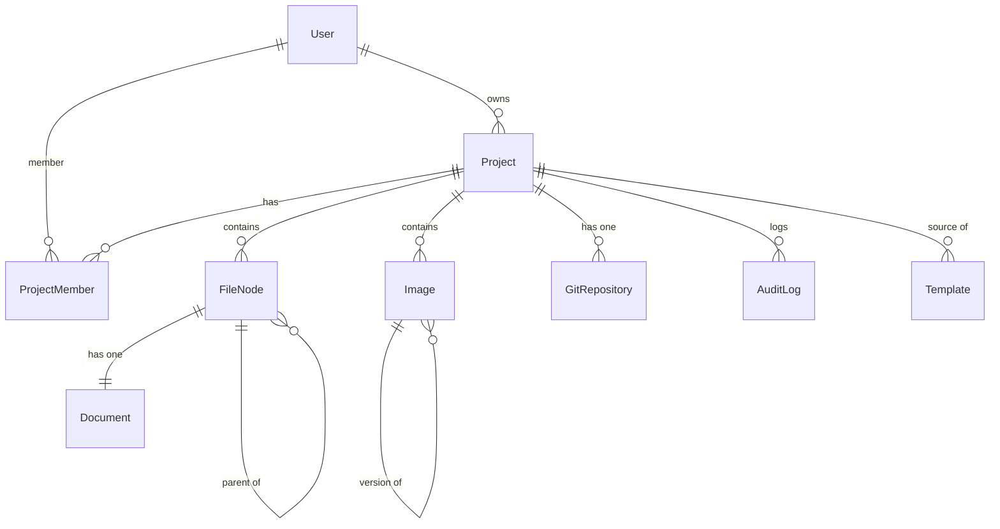

# Data Model: Database Layer

**Date**: 2026-05-27
**Phase**: Phase 1 — Design & Contracts

## Overview

This document defines the Prisma database schema mappings for all 9 domain entities. The schema is defined in
`packages/db/prisma/schema.prisma` and generates the `PrismaClient` used by repository implementations in
`packages/infrastructure`.

---

## Enums

Three Prisma enums map to domain value objects:

| Prisma Enum    | Domain Value Object | Valid Values                        |
|----------------|---------------------|-------------------------------------|
| `Role`         | `Role`              | `VIEWER`, `EDITOR`, `ADMINISTRATOR` |
| `FileNodeType` | `FileNodeType`      | `FILE`, `FOLDER`                    |
| `GitProvider`  | `GitProvider`       | `GITHUB`, `GITLAB`, `BITBUCKET`     |

Enum strings in Prisma records map to domain VOs via `Role.create()`, `FileNodeType.create()`, etc. (case-insensitive or
lowercase conversion).

---

## Tables

### User

| Column         | Type            | Constraints                     | Domain Field           |
|----------------|-----------------|---------------------------------|------------------------|
| `id`           | `String` (UUID) | `@id @default(uuid()) @db.Uuid` | `UserId`               |
| `email`        | `String`        | `@unique`                       | `Email`                |
| `displayName`  | `String`        | required                        | `string`               |
| `passwordHash` | `String?`       | nullable                        | `string \| null`       |
| `samlSubject`  | `String?`       | nullable                        | `string \| null`       |
| `mfaSecret`    | `String?`       | nullable                        | `string \| null`       |
| `createdAt`    | `DateTime`      | `@default(now())`               | `Timestamps.createdAt` |
| `updatedAt`    | `DateTime`      | `@updatedAt`                    | `Timestamps.updatedAt` |

### Project

| Column        | Type            | Constraints                     | Domain Field           |
|---------------|-----------------|---------------------------------|------------------------|
| `id`          | `String` (UUID) | `@id @default(uuid()) @db.Uuid` | `ProjectId`            |
| `name`        | `String`        | required                        | `ProjectName`          |
| `description` | `String?`       | nullable                        | `string \| null`       |
| `ownerId`     | `String` (UUID) | FK→User, `@db.Uuid`             | `UserId`               |
| `createdAt`   | `DateTime`      | `@default(now())`               | `Timestamps.createdAt` |
| `updatedAt`   | `DateTime`      | `@updatedAt`                    | `Timestamps.updatedAt` |

**Note**: The domain `Project` entity has `_tags: string[]` and `_rootFolderId: FileNodeId | null` as private fields.
The rootFolderId is set at creation time. Tags are stored as JSON or as a separate table depending on the final schema
decision (JSONB recommended for simplicity in Phase 2).

### ProjectMember

| Column      | Type            | Constraints                                  | Domain Field |
|-------------|-----------------|----------------------------------------------|--------------|
| `projectId` | `String` (UUID) | FK→Project, `@db.Uuid`, part of composite PK | `ProjectId`  |
| `userId`    | `String` (UUID) | FK→User, `@db.Uuid`, part of composite PK    | `UserId`     |
| `role`      | `Role` (enum)   | required                                     | `Role`       |
| `joinedAt`  | `DateTime`      | `@default(now())`                            | `Date`       |

Composite primary key: `@@id([projectId, userId])`

### FileNode

| Column      | Type                  | Constraints                                     | Domain Field           |
|-------------|-----------------------|-------------------------------------------------|------------------------|
| `id`        | `String` (UUID)       | `@id @default(uuid())`                          | `FileNodeId`           |
| `projectId` | `String` (UUID)       | FK→Project, `@db.Uuid`, indexed                 | `ProjectId`            |
| `parentId`  | `String?` (UUID)      | self-FK→FileNode, `@db.Uuid`, nullable, indexed | `FileNodeId \| null`   |
| `name`      | `String`              | required                                        | `string`               |
| `type`      | `FileNodeType` (enum) | required                                        | `FileNodeType`         |
| `path`      | `String`              | required                                        | `FilePath`             |
| `createdAt` | `DateTime`            | `@default(now())`                               | `Timestamps.createdAt` |
| `updatedAt` | `DateTime`            | `@updatedAt`                                    | `Timestamps.updatedAt` |

Index: `@@index([projectId])`, `@@index([parentId])`

### Document

| Column       | Type            | Constraints                        | Domain Field           |
|--------------|-----------------|------------------------------------|------------------------|
| `id`         | `String` (UUID) | `@id @default(uuid()) @db.Uuid`    | `DocumentId`           |
| `fileNodeId` | `String` (UUID) | `@unique`, FK→FileNode, `@db.Uuid` | `FileNodeId`           |
| `contentId`  | `String` (UUID) | required, `@db.Uuid`               | `ContentId`            |
| `yjsStateId` | `String` (UUID) | required, `@db.Uuid`               | `YjsStateId`           |
| `mimeType`   | `String`        | required                           | `MimeType`             |
| `createdAt`  | `DateTime`      | `@default(now())`                  | `Timestamps.createdAt` |
| `updatedAt`  | `DateTime`      | `@updatedAt`                       | `Timestamps.updatedAt` |

### Image

| Column        | Type             | Constraints                     | Domain Field      |
|---------------|------------------|---------------------------------|-------------------|
| `id`          | `String` (UUID)  | `@id @default(uuid())`          | `ImageId`         |
| `projectId`   | `String` (UUID)  | FK→Project, `@db.Uuid`, indexed | `ProjectId`       |
| `filename`    | `String`         | required                        | `string`          |
| `storagePath` | `String`         | required                        | `string`          |
| `mimeType`    | `String`         | required                        | `MimeType`        |
| `sizeBytes`   | `Int`            | required                        | `number`          |
| `parentId`    | `String?` (UUID) | FK→Image, `@db.Uuid`, nullable  | `ImageId \| null` |
| `uploadedAt`  | `DateTime`       | `@default(now())`               | `Date`            |
| `updatedAt`   | `DateTime?`      | nullable                        | `Date \| null`    |

Index: `@@index([projectId])`

### Template

| Column            | Type             | Constraints                      | Domain Field        |
|-------------------|------------------|----------------------------------|---------------------|
| `id`              | `String` (UUID)  | `@id @default(uuid())`           | `TemplateId`        |
| `name`            | `String`         | required                         | `string`            |
| `description`     | `String?`        | nullable                         | `string \| null`    |
| `category`        | `String`         | required                         | `TemplateCategory`  |
| `sourceProjectId` | `String?` (UUID) | FK→Project, `@db.Uuid`, nullable | `ProjectId \| null` |
| `createdAt`       | `DateTime`       | `@default(now())`                | `Date`              |

### GitRepository

| Column          | Type                 | Constraints                       | Domain Field      |
|-----------------|----------------------|-----------------------------------|-------------------|
| `id`            | `String` (UUID)      | `@id @default(uuid())`            | `GitRepositoryId` |
| `projectId`     | `String` (UUID)      | `@unique`, FK→Project, `@db.Uuid` | `ProjectId`       |
| `provider`      | `GitProvider` (enum) | required                          | `GitProvider`     |
| `remoteUrl`     | `String`             | required                          | `string`          |
| `credentialRef` | `String`             | required                          | `string`          |
| `currentBranch` | `String`             | `@default("main")`                | `string`          |
| `lastSyncAt`    | `DateTime?`          | nullable                          | `Date \| null`    |
| `createdAt`     | `DateTime`           | `@default(now())`                 | `Date`            |

### AuditLog

| Column         | Type             | Constraints                               | Domain Field              |
|----------------|------------------|-------------------------------------------|---------------------------|
| `id`           | `String` (UUID)  | `@id @default(uuid())`                    | `AuditLogId`              |
| `userId`       | `String` (UUID)  | FK→User, `@db.Uuid`, indexed              | `UserId`                  |
| `projectId`    | `String?` (UUID) | FK→Project, `@db.Uuid`, nullable, indexed | `ProjectId \| null`       |
| `action`       | `String`         | required                                  | `string`                  |
| `resourceType` | `String`         | required                                  | `string`                  |
| `resourceId`   | `String`         | required                                  | `string`                  |
| `timestamp`    | `DateTime`       | `@default(now())`                         | `Date`                    |
| `metadata`     | `Json?`          | nullable                                  | `Record<string, unknown>` |

Indexes: `@@index([projectId])`, `@@index([userId])`

---

## Key Relationships

### Relationship Rules

1. **Project → User**: Many-to-one. `ownerId` FK. No cascade delete (owner can't be deleted while projects exist).
2. **ProjectMember → Project + User**: Many-to-one on both sides. Composite PK. Cascade delete when project is deleted.
3. **FileNode → Project**: Many-to-one. Cascade delete when project is deleted.
4. **FileNode.parentId**: Self-referencing nullable FK. Forms the file tree.
5. **Document → FileNode**: One-to-one via unique `fileNodeId`. Cascade delete when FileNode is deleted.
6. **Image → Project**: Many-to-one. No cascade (images retained for audit even if project is removed).
7. **Image.parentId**: Self-referencing nullable FK for version chain.
8. **GitRepository → Project**: One-to-one via unique `projectId`. Cascade delete when project is deleted.
9. **Template → Project**: Optional many-to-one via `sourceProjectId`. No cascade (template survives project deletion).
10. **AuditLog → User + Project**: Many-to-one. No cascade delete (audit records are immutable).

---

## Mapping Notes

### UUID Handling

All entity ID columns use PostgreSQL's native `uuid` type via `@db.Uuid` with `@default(uuid())` generating UUID v4
values.
All FK columns referencing UUID IDs also use `@db.Uuid`. The domain layer wraps raw UUID strings in typed value objects
(`UserId`, `ProjectId`, etc.). Repository `toDomain()` methods call `XxxId.create(record.id)` and `toPersistence()`
methods use `entity.id.value`.

PostgreSQL's native UUID type stores UUIDs in a compact 16-byte format (vs. variable-length text) and is indexed more
efficiently. The Prisma client still exposes the field as a JavaScript `string`, so no type changes are needed in the
mapping logic.

### Timestamps

Domain entities use the `Timestamps` value object (defensive date copies). Prisma records use `DateTime` columns with
`@updatedAt` for Prisma-managed timestamp updates. Repository mapping:

- `toDomain()`: `new Timestamps(record.createdAt, record.updatedAt)`
- `toPersistence()`: `{ createdAt: timestamps.createdAt, updatedAt: timestamps.updatedAt }`

### Null Handling

Nullable domain fields (`string | null`, `Date | null`) map directly to Prisma optional columns. `null` in Prisma maps
to JavaScript `null`, which maps correctly to domain nullable types.

### JSON Handling

`AuditLog.metadata` is `Record<string, unknown>` in the domain and `Json?` in Prisma. Prisma's JSON type returns
`unknown` or `Prisma.JsonValue`, which may require type narrowing in the `toDomain()` method.
